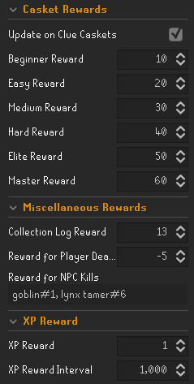

# Personal Currency Tracker

# Changing the amount #
There are 2 ways to change the amount
1. Use the commands
   - ```::add x``` adds ```x``` coins to your balance
   - ```::remove x``` removes ```x``` coins from your balance
   - ```::set x``` sets your balance to ```x``` 
2. Change it manually through the Config Panel

# Checking the Amount #
1. Check the info panel if it is enabled
2. Use the command ```::count```

# Custom Coin Image #
To use a custom image, set the Coin Type option to `Custom` in the Config Panel, and place your image named ```coin.png``` in ```%userprofile%\.runelite``` on Windows or `~/.runelite/` on Linux/macOS.

If this does not work, try renaming your coin image to just `coin`.

# Automatic Balance Updates

You can also have your balance automatically update by specified amounts



## Casket Rewards
- For each tier of casket, one can choose a separate value
- The rewards are ***only granted*** if the `Update on Clue Caskets` option is enabled (To make disabling them easy without having to change every reward value)

## Miscellaneous Rewards
- Here, you can set rewards for *new collection log slots*, however this makes no distinction based on the category it belongs to in the collection log (*soon&trade;*).
- Also, a "reward" for dying can be set here.
  - In this example, you are punished 5 coins for every death
- Finally, a Reward for **killing NPCs** can be set. This is formatted as a comma-separated list of pairs of `<npc-name>#<kill-reward`.
  - In the example, a reward of 1 coin is granted for killing a Goblin, and 6 for killing a Lynx Tamer
  - A death of an NPC is counted as a _kill_, if the NPC was tagged by the player beforehand.

## XP Rewards
- `XP Reward`: How many coins to award
- `XP Reward Interval`: How often to award the xp reward
  - If the interval is `0`, then no coins will be awarded.

In the example, the player is awarded 1 coin for every 1000 xp gained.

---

If you have ideas/wishes for other balance update options, you can let me know by creating an issue :smile: .
